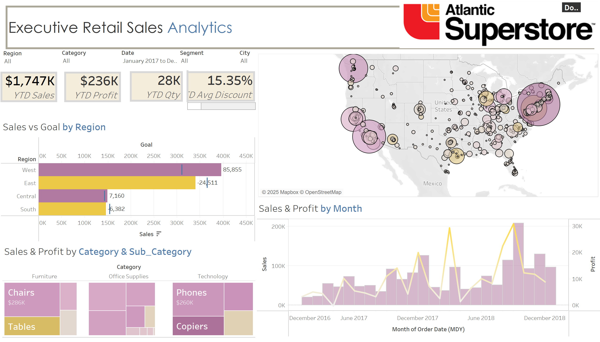

# Retail_Sales_Dashboard
This repository contains an interactive Tableau dashboard for Executive Retail Sales Analytics, built using the Maven Market dataset. It provides insights into sales, profit, and regional performance over time

# Executive Retail Sales Dashboard

## Overview :  
This dashboard provides insights into retail sales performance, focusing on key metrics like sales, profit, and regional performance. It helps executives track business growth and optimize decision-making.

## Dataset Used :  
- Maven Market Dataset (includes transactions, customers, products, stores, and regions data)

## Tool Used :  
&nbsp;

## Results and Insights :  
- Total **Year-to-Date (YTD) Sales** amount to **$1.74M**, with a **YTD Profit** of **$236K**.  
- The **West region** has outperformed its sales goals, while the **East region** fell short.  
- The **Technology** category, particularly **Phones**, has the highest sales.  
- Sales and profit trends indicate seasonal fluctuations, with peaks around **December** each year.  
- Higher discounts (15.35% on average) correlate with increased quantity sold but impact profitability.  

## Additional Insights :  
- **Regional performance** analysis helps in setting sales targets and allocating resources efficiently.  
- **Category & Sub-Category** breakdown provides a deeper understanding of top-selling products.  
- **Sales & Profit trends by Month** highlight seasonal demand patterns for better inventory planning.  

## Data Story :  
The dashboard provides a comprehensive view of retail sales performance across different regions and categories. It helps executives identify trends, optimize pricing strategies, and improve operational efficiency.  

## Dashboard :  

